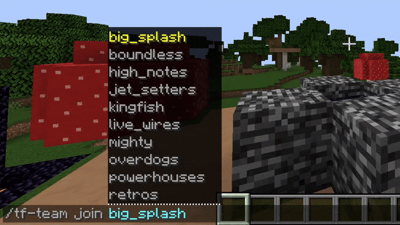
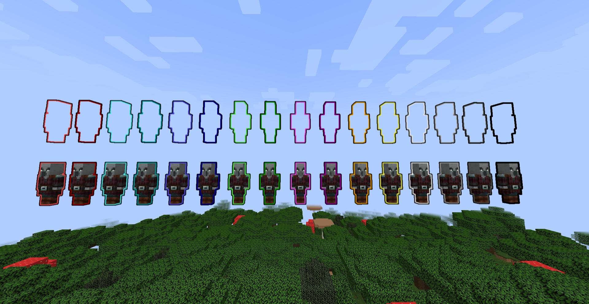
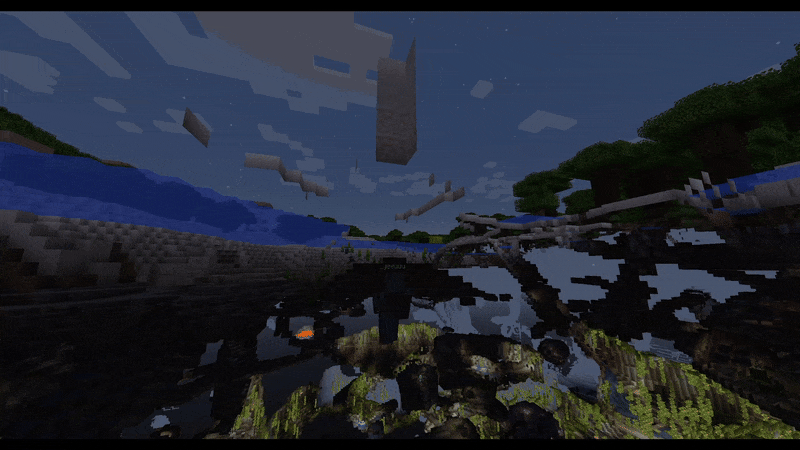
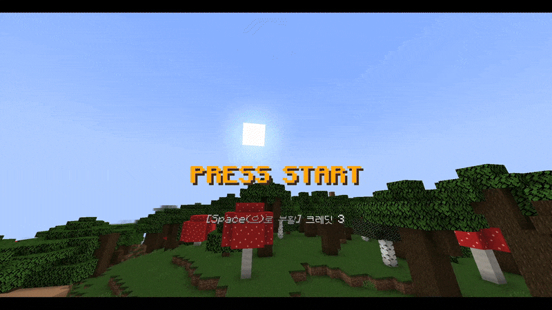
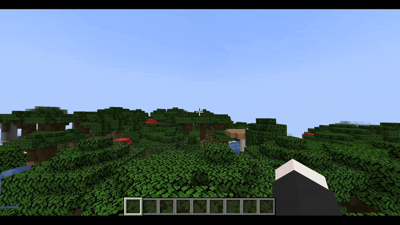

# THE FINALS Plugin

게임 [THE FINALS](https://www.reachthefinals.com)를 따라 만든 플러그인입니다.

Paper `1.21.4` 버전을 사용했습니다.

# 주요 기능

게임에 나오는 요소중 **팀 시스템**에서 아이디어를 얻어 구현했습니다.

## 팀 시스템

게임에서 등장하는 팀과 똑같은 팀이 존재합니다.\

팀에 **가입** 및 **탈퇴**가 가능합니다. ([명령어](#팀-명령어) 참조)

팀마다 고유한 색상이 있습니다. (플레이어 목록에서 이름의 색깔로 표시됨)\

*이외에 아직 별 기능은 없습니다*

> *마인크래프트 팀 색깔 설정의 한계로 색깔이 비슷해 보이는 팀도 있습니다*

모든 팀에는 자유롭게 가입할 수 있으며, 인원수에 **제한은 없습니다.**

## 플레이어 사망/부활

플레이어 사망시 자리에 해당 플레이어의 **피규어**가 남습니다.\

게임과 똑같이 **집을 수** 있으며 **웅크리기를 길게 눌러** 플레이어를 부활시킬 수 있습니다.\

또는 죽은 플레이어가 **크래딧(코인)** 을 가지고 있을 시 **직접** 부활 할 수도 있습니다.\
\
*당연히 코인이 없다면 부활 할 수 없습니다!*
> *부활시 설정된 리스폰 위치에서 부활하거나 월드 스폰에서 부활합니다.*

> 코인은 **발전과제를 달성**하면 1개씩 얻을 수 있습니다.\
> *(이는 추후 조정될 수 있습니다.)*

## 팀 전멸

팀 구성원이 **모두 죽었을 때** 팀 전멸이 일어납니다.

> 전멸시 해당 팀은 **모든 아이템과 레벨**을 잃습니다.

# 명령어

## 팀 명령어

이 명령어를 사용하려면 **관리자**여야 합니다.

* 팀에 가입\
  `tf-team join <team name> [players]`\
  지정된 플레이어(또는 자기 자신만) 팀에 추가합니다.

* 팀에서 탈퇴\
  `tf-team leave [players]`\
  지정된 플레이어(또는 자기 자신만) 팀에서 제거합니다.

* 팀 색상 변경\
  `tf-team color <color>`\
  팀의 색상을 바꾸면 **해당 색깔의 팀**과 색상이 교체됩니다.

